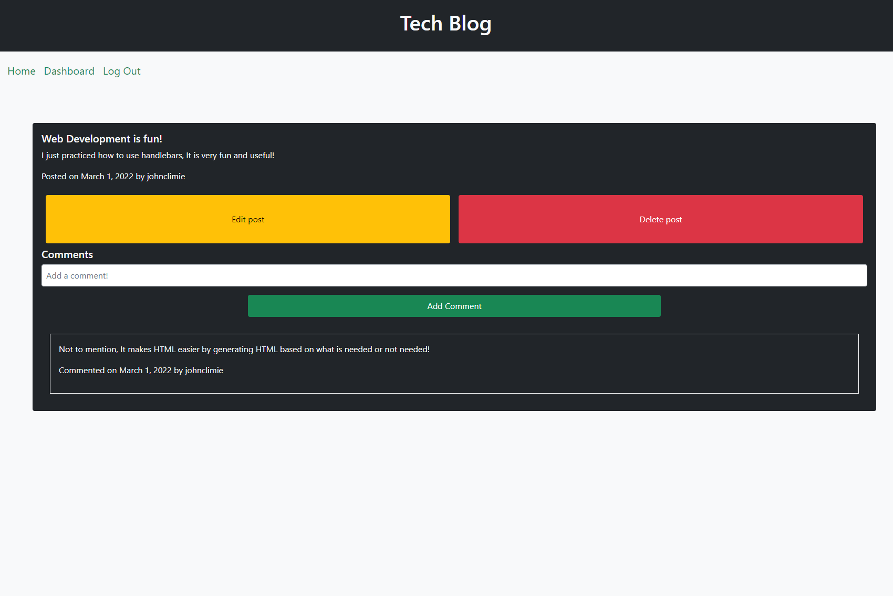

# Tech Blog

## Description

In this project, I created a full stack tech blog with the use of several tools. This project was created from a blank slate, Therefore I had to use extensive research in order to complete this project. I had to use both my knowledge in front-end and back-end development.

The user can create new posts and add comments to existing posts. The user can also edit their own post or delete it if they have the desire. The homepage views all existing posts, while the dashboard views all posts that the user created, where they can edit or delete their posts.

I created this project with the use of Handlebars.js which is a new rendering engine I have learned to use in this project. I also used sequelize for data management. Express was also in use for routing between the webpages, along with Node.js

This project was my biggest challenge yet. Considering I had to start with no starter code, I had to go into this project with research into how to use Handlebars, Sequelize and Express all together. This was very difficult project, however I got new knowledge out of it. This project is very beneficial for my MERN skill stack.

**Link**

Heroku Deployment: https://techblogjc.herokuapp.com/
